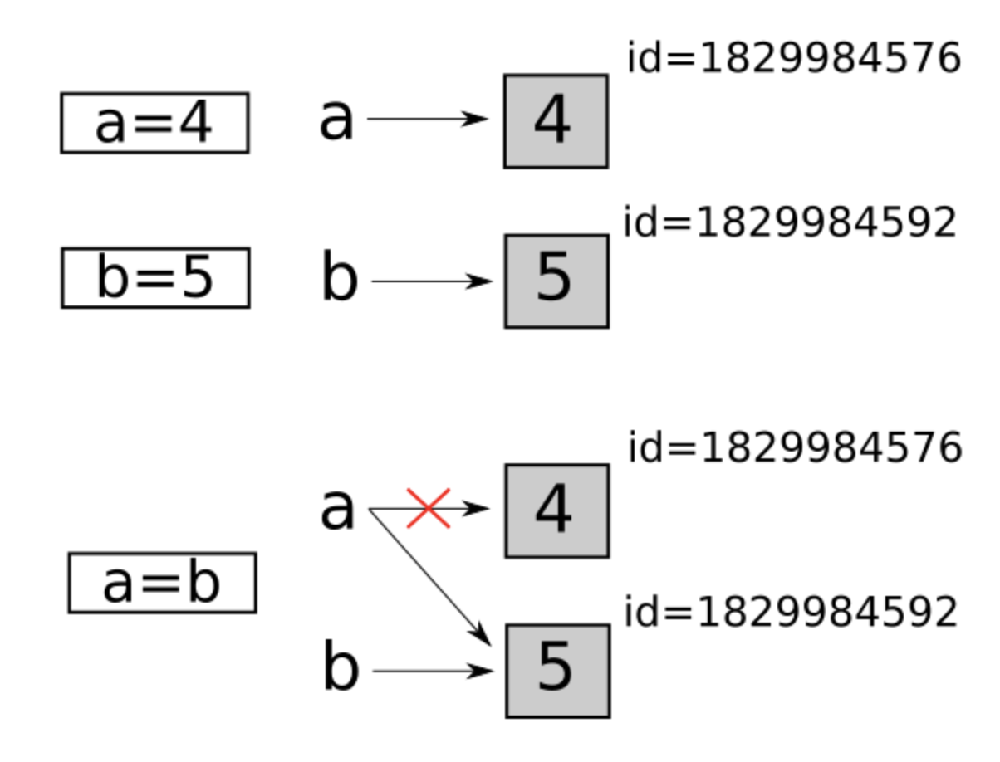

# Часть 1
Добро пожаловать в мир объектов! Посмотрите на эту красоту: Стройные деревья, классы и обширные поля.

Давайте я проведу Вам экскурсию. Давайте посмотрим на этот прекрасный сад. 

```python
class Tree:
   def BinaryTree(r):
       return [r, [], []]

   def insertLeft(root, newBranch):
       t = root.pop(1)
       if len(t) > 1:
           root.insert(1, [newBranch, t, []])
       else:
           root.insert(1, [newBranch, [], []])
       return root

   def insertRight(root, newBranch):
       t = root.pop(2)
       if len(t) > 1:
           root.insert(2, [newBranch, [], t])
       else:
           root.insert(2, [newBranch, [], []])
       return root

   def getRootVal(root):
       return root[0]

   def setRootVal(root, newVal):
       root[0] = newVal

   def getLeftChild(root):
       return root[1]

   def getRightChild(root):
       return root[2]


list_tree = []

for _ in range(100):
   list_tree.append(Tree())
```
Или посмотрите на эти просторные поля:
```python
class Fields:
   field_1 = 0
   field_2 = 0
   field_3 = 0
   field_4 = 0
   field_5 = 0
   field_6 = 0
   field_7 = 0
   field_8 = 0
   field_9 = 0
   field_10 = 0
```
Все это – объекты!
А теперь, посмотрите, на эту собачонку: 
```python
dog = Dog()
```
Давайте дадим этому **объекту** другое имя.
```python
ball = Dog()
```
Теперь нашу собаку зовут “Шарик”

Мы можем попробовать создать новый объект. Такой же как эта собака:

```python
ball_copy = ball
```
Давайте теперь попробуем узнать цвет шерсти у этих собак:
```python
print(ball_copy.get_wool()) # black
print(ball.get_wool()) # black
```
У них одинаковые цвета. Такое бывает! Но может, это просто один и тот же объект? Давайте проверим это опытным путём!
```python
ball_copy_1 = ball
ball_copy_2 = ball
ball_copy_3 = ball

print(ball_copy.get_wool()) # black
print(ball_copy_1.get_wool()) # black
print(ball_copy_2.get_wool()) # black
print(ball_copy_3.get_wool()) # black
print(ball.get_wool()) # black
```
Как вы можете увидеть, они все черные. И действительно, с чего мы взяли, что дав разные клички нашей собаке мы сделаем её копии?

В этом мире объектов есть очень уважаемая функция: 
```python
copy()
```
Это очень уважаемая колдунья. Она умеет копировать все, что только существует в Python!
Давайте позовем её к нам на помощь с помощью этого заклинания:
```python
from copy import copy
```
И теперь попросим её наколдовать нам копии:
```python
ball_copy_1 = copy(ball)
ball_copy_2 = copy(ball)
ball_copy_3 = copy(ball)

#...
# Вызов методов для изменения цвета.
#...

print(ball_copy_1.get_wool()) # green
print(ball_copy_2.get_wool()) # red
print(ball_copy_3.get_wool()) # yellow
print(ball.get_wool()) # black
```
Как мы видим, цвета разные! Почему так?

Все дело в том, что в Python нет переменных, но есть только имена объектов.
Когда мы назначаем объекту разные имена, мы по сути создаем ссылки на них. И по факту, разные имена - это просто разные ссылки на одно и тоже место в памяти. Поэтому, нам надо давать не разные имена, точнее, не только это, но и копировать сами объекты в памяти с помощью функции
`copy()`

<p align="center">
    
</p>