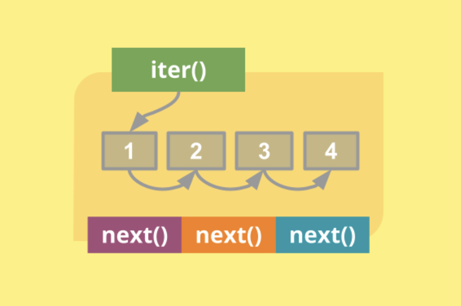

# Часть 3
### Протокол итерации 
Протокол итерации — один из самых важных протоколов в Python. Ведь именно он позволяет циклу for работать с самыми разными коллекциями единообразно.

Этот протокол требует от объекта быть итерируемым. Т.е он требует, чтобы у объекта был метод  __iter__()  и __next__().

Протокол итерации работает примерно так: Объект становится итеруемым с помощью функции iter() или метода __iter__(), далее, мы вызываем на него функцию next() до тех пор, пока она не выбросит исключение StopIteration.

У каждого итератора присутствует метод __iter__() - то есть, любой итератор является итерируемым объектом. Этот метод возвращает сам итератор.

Пример создания итератора из списка:

```python
L = list(range(10))
I = iter(L)# создание итератора.

print(next(I)) # 0
print(next(I)) # 1
print(next(I)) # 2
```
<p align="center">
    
</p>

### Более сложный пример

По своей сути итерационный контекст является синтаксическим сахаром над циклом while. Объясню почему. Цикл while является универсальным циклом в Python! С его помощью можно сделать все. В том числе проитерировать объект:

```python
L = [1, 2, 3]

I = L.__iter__() # Итератор
while True:
   try:
       X = I.__next__() # Объект итератора
   except StopIteration:
       break
   else:
       print(X)
```
В данном случае мы просто создали из объекта L итерируемый объект. С помощью метода __iter__() и просто бесконечно вызывали метод __next__() до тех пор, пока не было получено соответствующее исключение. 

Цикл for делает все это неявно:
 
```python
for i in L:
   print(i)
```
### Генераторы
В Python не только коллекции являются iterable. Ещё существуют так называемые генераторы (generators). Что же такое генератор? Генератор — это iterable, элементы которого не хранятся в нём, но создаются по мере необходимости. Для примера возьмём генератор range. Вот как он работает:

```python
numbers = range(3, 11, 2)
for n in numbers:
   print(n)

# => 3
# => 5
# => 7
# => 9
list(numbers)  # [3, 5, 7, 9]
```
range представляет собой перезапускаемый генератор. Для такого генератора можно создавать сколько угодно итераторов, и для каждого из них значения будут генерироваться заново.

Как же создаются генераторы? В Python есть два типа генераторов: генераторные выражения и генераторные функции. Синтаксис первых очень похож на синтаксис списковых включений. Поэтому не будем на них останавливаться. 


```python
print([x for x in [1, 2, 3]]) # Вывод спискового включения.
print(list(x for x in [1, 2, 3])) # Вывод генераторного выражения.
```
Генераторные функции нам будут намного интереснее. Так как их можно итерировать несколько раз, в отличие от выражений. Более того, на них строится асинхронность в Python.

Очень важный факт: генераторные функции скомпилированы так, чтобы сразу возвращать объект генератора. Т.е у них есть итератор: 

```python
gen = func_gen()

print(iter(gen) is gen) # Вернет True
```
Но сначала разберем важное ключевое слово yield – оно позволяет сделать функцию генератором значений. То есть, если в функции есть этот оператор, то функция будет возвращать одно значение за вызов и сохранять состояние всех имен на момент последнего вызова. Именно так и работает функция range:

```python
def my_range(end):
   stop = 0
   while stop < end:
       yield stop
       stop += 1


for i in my_range(10):
   print(i)

print('-' * 10)

for i in my_range(10):
   print(i)

print('-' * 10)
```
Теперь мы плавно подошли к тому, что эти функции идеально поддерживают протокол итерации, как было описано выше. Выигрываем мы тут в том, что теперь мы можем строить не сразу же весь список, как например со списковыми включениями, а один результат по запросу. Это очень удобно при чтении больших файлов или при работе с серверами.
